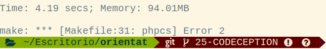
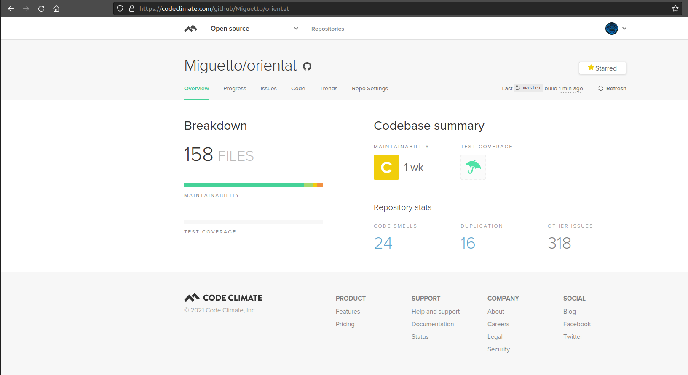
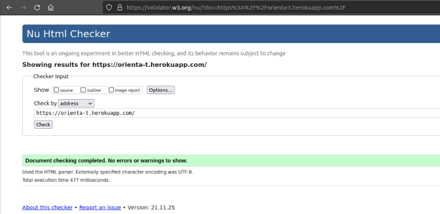
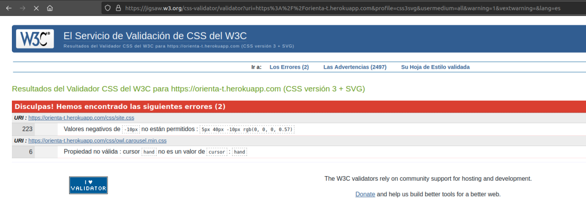
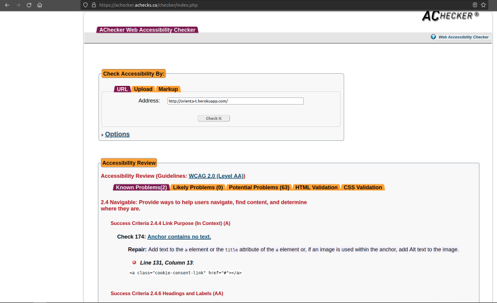

# Anexos

**-Prueba del seis-**.

**1- ¿Qué sitio es este?**
- La aplicación en todo momento muestra el logotipo indicando en que sitio estás.

**2- ¿En qué ṕagina estoy?**
- Todas las pantallas de la web indican con encabezados en el sitio que te encuentras, con la ayuda también de las migas de pan.

**3- ¿Cuales son las principales secciones del sitio?**
- Si no estás logueado son: *Index*, *Registrarse*, *Login*.
- Si estás logueado: *Mi perfil*.

**4- ¿Que opciones tengo en este nivel?**
- En cualquier nivel se puede navegar hacia otros niveles a través del menú de navegación y botones.

**5- ¿Dónde estoy en el esquema de las cosas?**
- En todas las pantallas se puede ver a través del menú de navegación y migas de pan donde estoy.

**6- ¿Cómo busco algo?**
- La aplicación cuenta con su propio buscador en las distintas secciones.

---

(**([R25](https://github.com/Miguetto/orientat/issues/25)) Codeception**).

(**([R26](https://github.com/Miguetto/orientat/issues/26)) Code Climate**).

(**([R34](https://github.com/Miguetto/orientat/issues/34)) Code Climate**).

**HTML**

**CSS**

**Accesibilidad**

