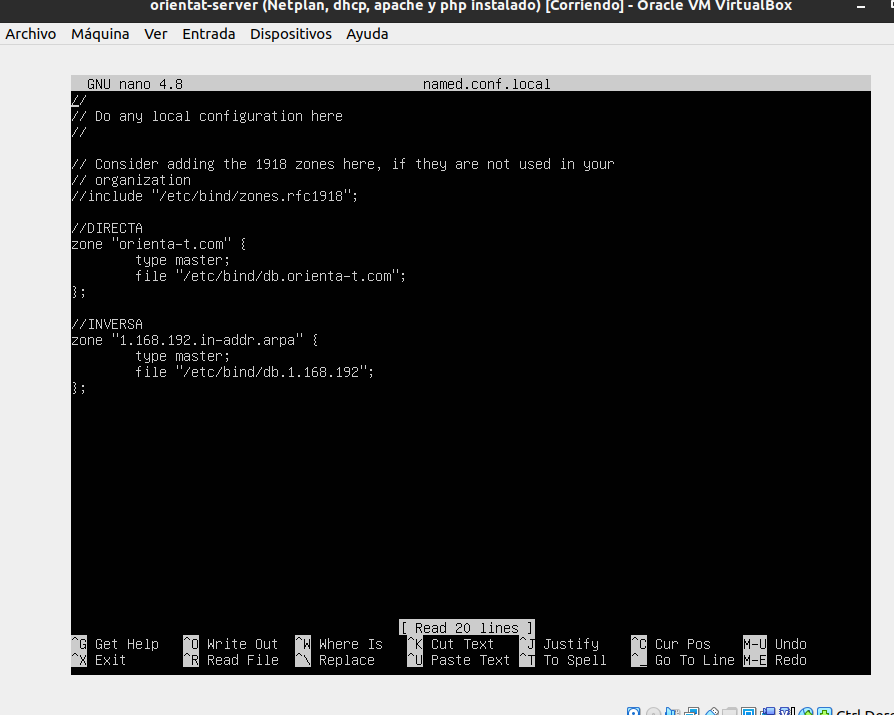

# Anexos

**-Prueba del seis-**.

**1- ¿Qué sitio es este?**
- La aplicación en todo momento muestra el logotipo indicando en que sitio estás.

**2- ¿En qué ṕagina estoy?**
- Todas las pantallas de la web indican con encabezados en el sitio que te encuentras, con la ayuda también de las migas de pan.

**3- ¿Cuales son las principales secciones del sitio?**
- Si no estás logueado son: *Index*, *Registrarse*, *Login*.
- Si estás logueado: *Mi perfil*.

**4- ¿Que opciones tengo en este nivel?**
- En cualquier nivel se puede navegar hacia otros niveles a través del menú de navegación y botones.

**5- ¿Dónde estoy en el esquema de las cosas?**
- En todas las pantallas se puede ver a través del menú de navegación y migas de pan donde estoy.

**6- ¿Cómo busco algo?**
- La aplicación cuenta con su propio buscador en las distintas secciones.

---

(**([R25](https://github.com/Miguetto/orientat/issues/25)) Codeception**).


(**([R26](https://github.com/Miguetto/orientat/issues/26)) Code Climate**).


(**([R34](https://github.com/Miguetto/orientat/issues/34)) Validación HTML5, CSS3 y Accesibilidad**).

**HTML**


**CSS**


**Accesibilidad**


(**([R35](https://github.com/Miguetto/orientat/issues/35)) Diseño para varias resoluciones**).

**Grandes resoluciones**


**Pequeñas resoluciones**


(**([R36](https://github.com/Miguetto/orientat/issues/36)) Varios navegadores**).

**Brave**


**Chrome**


**Mozilla Firefox**


(**([R38](https://github.com/Miguetto/orientat/issues/38)) Despliegue en servidor local**).

*DHCP*
- Configuramos la red en el servidor:


- Configuramos la red en el cliente:


*DNS*
- Editamos /etc/bind/named.conf.local:



- Editamos /etc/bind/db.orienta-t.com:


- Editamos /etc/bind/db.1.168.192:


*APACHE*
- Editamos /etc/apache2/sites-available/000-default.conf para el directorio del proyecto y la redirección:


*SSL*

**1- Generar clave privada y la solicitud**
    ```
    $ openssl genrsa -out orienta-t.key 2048
    ```

    ```
    $ openssl x509 -req -days 365 -in orienta-t.csr -signkey orienta-t.key -out orienta-t.crt
    ```
**2- Mover las claves y el certificadoa los directorios de apache**
    ```
    $ sudo mv orienta-t.key /etc/ssl/private/
    $ sudo mv orienta-t.crt /etc/ssl/certs/
    ```
**3- Configurar los permisos**
**4- Crear el fichero de configuración**
    ```
    $ $ sudo nano /etc/apache2/sites-available/orienta-tssl.conf
    ```

**5- Habilitamos el módulo ssl**
    ```
    $ sudo a2enmod ssl
    ```

**6- Activamos el servicio**
    ```
    $ sudo a2enmod orienta-tssl
    ```

*FINAL*


