# Manual de usuario

### Pantalla de inicio (sin estar logueado)
La página principal dispone de un botón en el centro de la pantalla para quienes no estén registrados, además de contener dos enlaces en la parte superior derecha, uno para el registro y otro para loguearse en el caso de que ya se esté registrado.

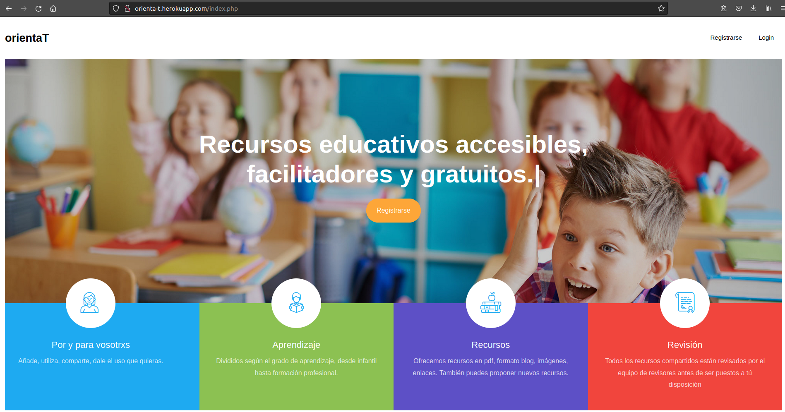

### Pantalla de registro
En la página de registro aparece un formulario dónde introduciremos lo que nos pide: Nombre, Nombre de usuario, Email, Contraseña, Repetir contraseña. Una vez añadido todo le damos a guardar. En este momento nos muestra un mensaje diciendo que necesitamos validarnos por correo, miramos el correo con el que hemos hecho el registro y aceptamos la validación.

Una vez todo lo anterior, estamos preparados para loguearnos.

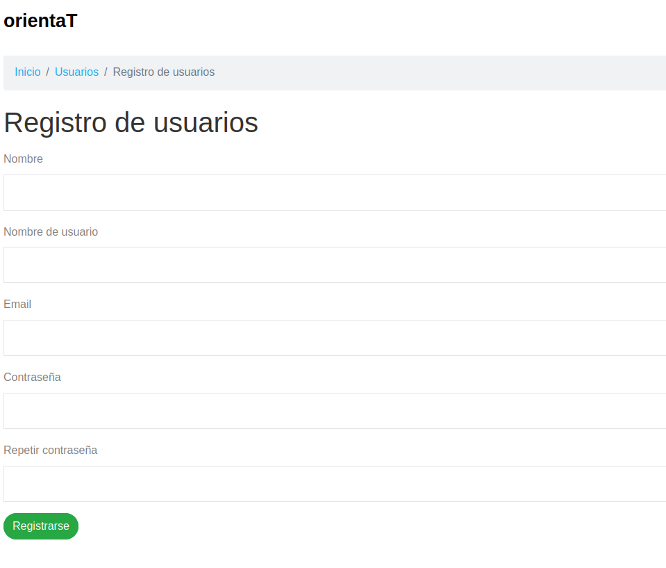

### Pantalla de Logueo
Esta página muestra un formulario de acceso a usuarios registrados, introduciremos el nombre de usuario y la contraseña. Aparece la opción para recordar los datos, para cuando vuelvas a entrar en la aplicación sigas logueado.

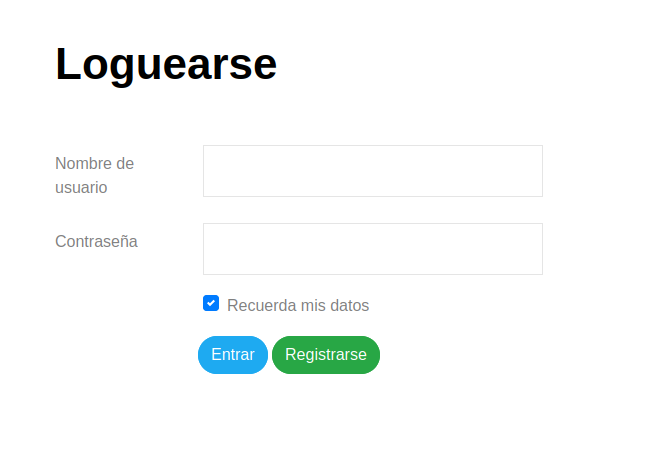

### Pantalla de inicio (estando logueado como Administrador)
Si el usuario es admin aparece en la parte superior un menú con más opciones que si el usuario es revisor o usuario.
La página que nos aparece es la de Mi perfil, donde aparecen acciones a realizar con nuestro perfil, algunos detalles de nuestro perfil y el listado de nuestros recursos.

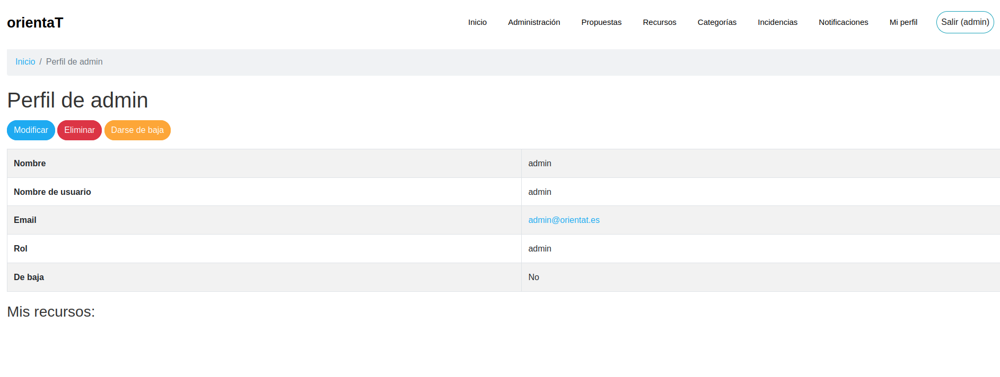

### Pantalla de inicio (estando logueado como Revisor)
Muy similar a la anterior, pero con menos opciones en el menú.

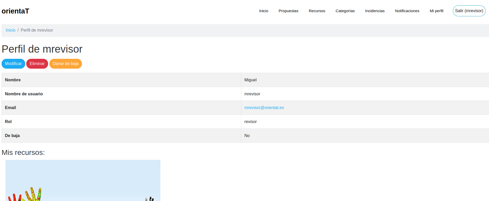

### Pantalla de inicio (estando logueado como Usuario)
Muy similar a la anterior pero en el menú aparecen las opciones que podemos ver con el tipo de usuario.

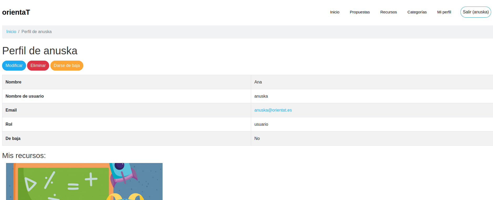

### Pantalla de administración
El administrador es el único que puede visitar este apartado, y en él se encuentran dos tablas:

Usuarios: para poder gestionar los diferentes usuarios que están registrados en la aplicación.
Recursos: para poder gestionar los diferentes recursos que están almacenados en la aplicación.

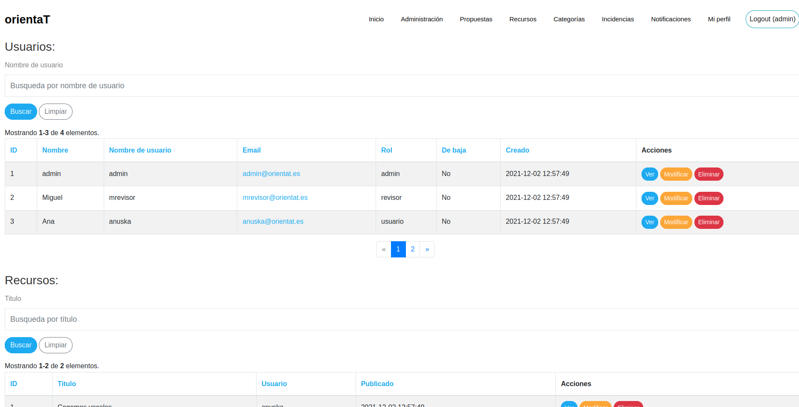

### Pantalla de propuestas
En esta página encontramos las diferentes propuestas creadas por los revisores a las cuales podemos votar para que la creen como recurso.

Si eres admin o revisor aparece un botón para crear la propuesta y si eres usuario no.

Aparece también el título de la propuesta, la descripcion, el número de votos y un botón para dicha acción.

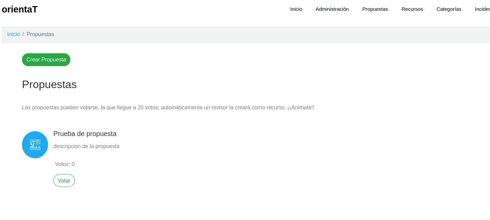

### Pantalla de recursos
Aquí aparecen todos los recursos publicados, un botón para crear un nuevo recurso y una barra de búsqueda por título.

Cada recurso tiene un boton para seguir leyendo y uno para dar like.

Al pulsar el botón de crear recurso nos envía a un formulario dónde añadiremos el título del recurso, descripción, contenido del recurso, categoría del recurso, enlace, imagen o pdf.

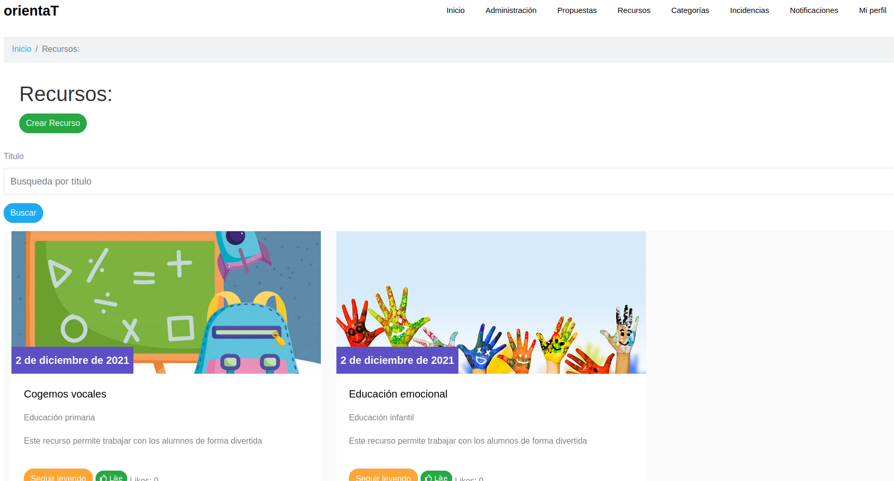

### Pantalla de ver recurso
Tenemos el recurso que hemos seleccionado para seguir leyendo y en el nos encontramos el contenido del recurso, quién ha sido el creador y un botón para comentar el recurso.

Si eres el creador, una vez tengas un comentario podrás responder dicho comentario.

### Pantalla de categorías
Encontramos las categorías disponibles, por cada categoría tendremos un boton (ver), que nos llevará a otra página con los recursos disponibles de esa categoría.
Y un buscador para las categorias.

Si eres admin o revisor tienes más acciones disponibles.

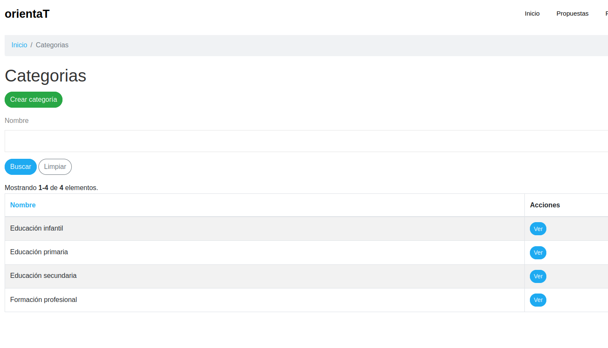

### Pantalla de categorías con filtros de búsqueda
Cuándo accedemos desde la página de Categorías a una categoría en concreto, nos muestra esta página, dónde encontramos una barra de búsqueda para filtrar por título y un filtro desplegable para filtrar los recursos de esa categoría por imágen, pdf o completos.

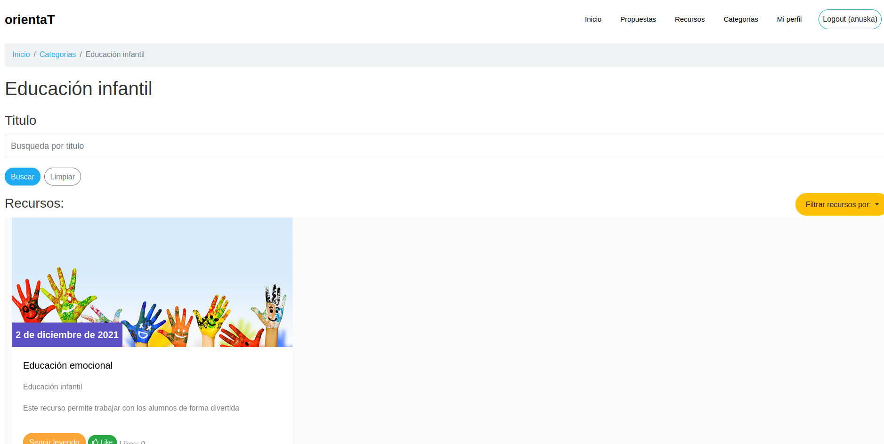

### Pantalla de incidencias
Los revisores pueden desde aquí mandar incidencias al administrador, desde el botón crear incidencia en el cual nos abre un formulario donde introducir el mensaje para el administrador.

De este modo, el administrador recibe las incidencias y puede ver las incidencias.

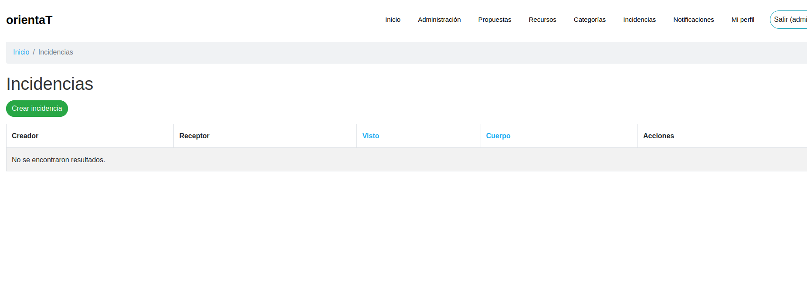

### Pantalla de notificaciones
Cuándo se crea un recurso se envía una notificación a los revisores para que validen o rechacen dicho recurso.

En esta página aparecen las notificaciones y un botón para ver el recurso a validar o rechazar.

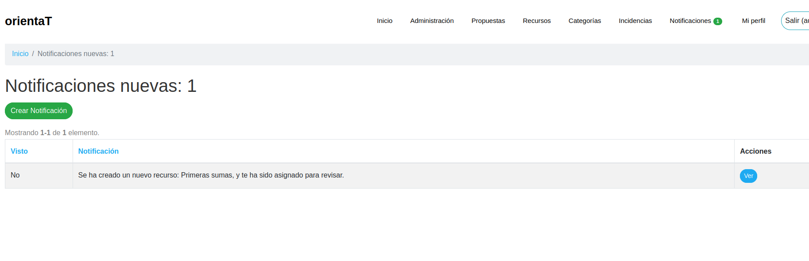

